# 🎯 System Architecture Diagram

## Overall Data Flow

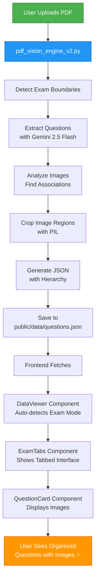

## Component Interaction

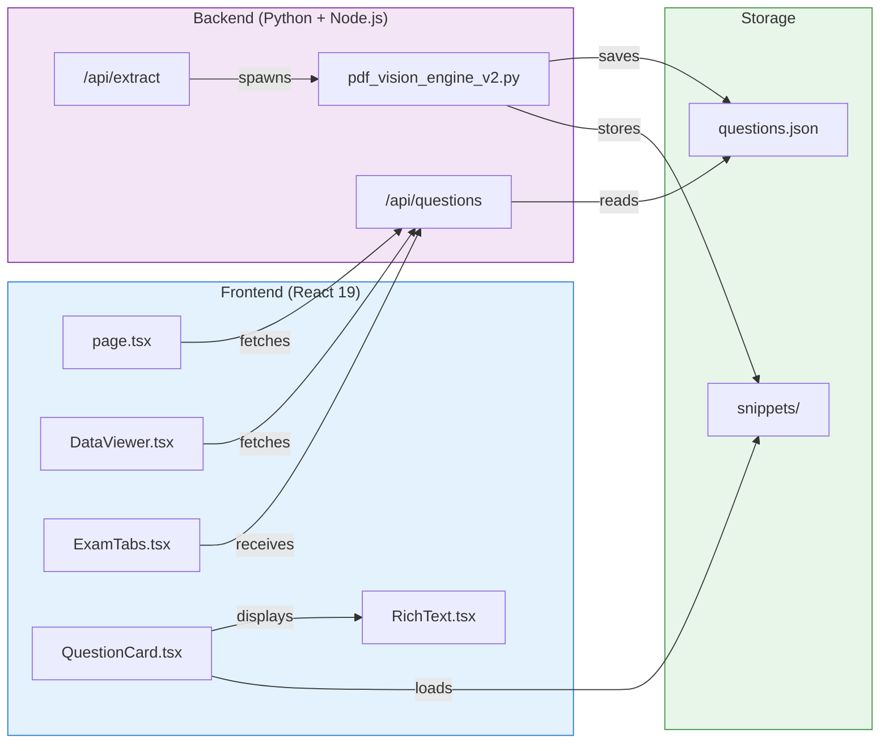

## Data Structure Hierarchy

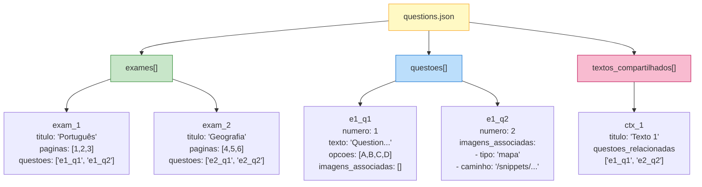

## Exam Detection Flow

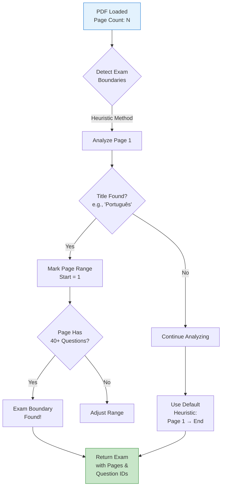

## Image Association Process

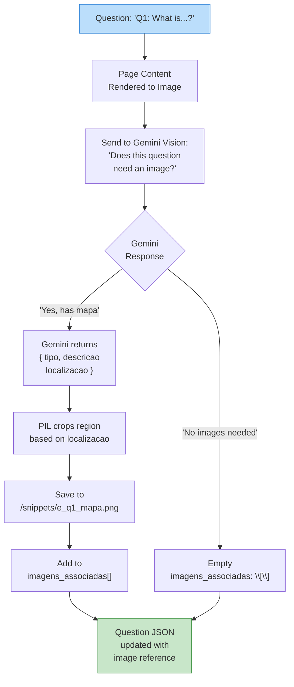

## File Organization

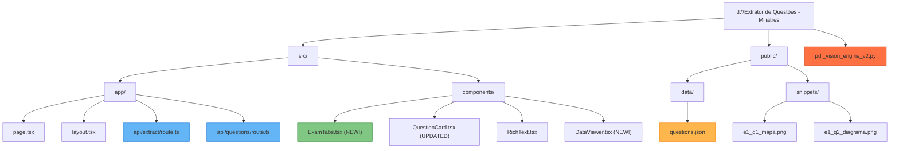

## React Component Tree

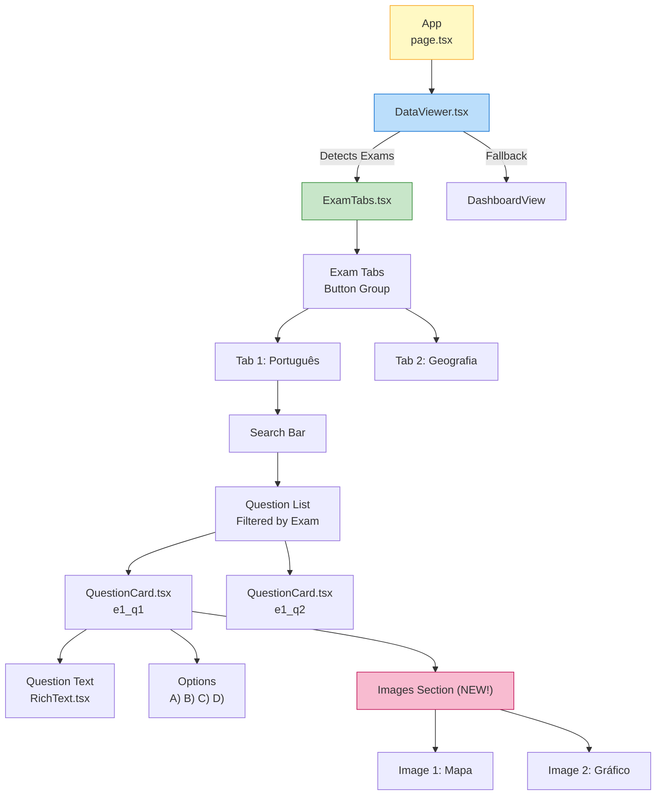

## API Endpoints

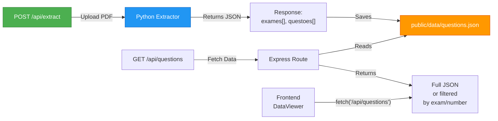

## Deployment Architecture

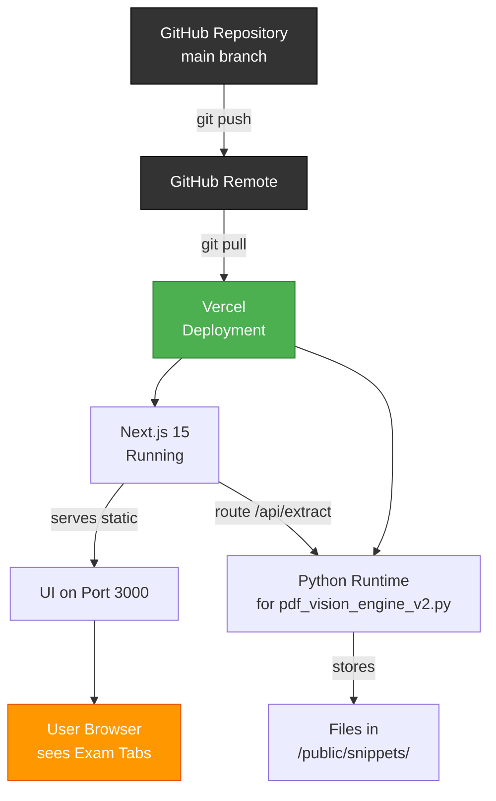

## Error Handling Flow

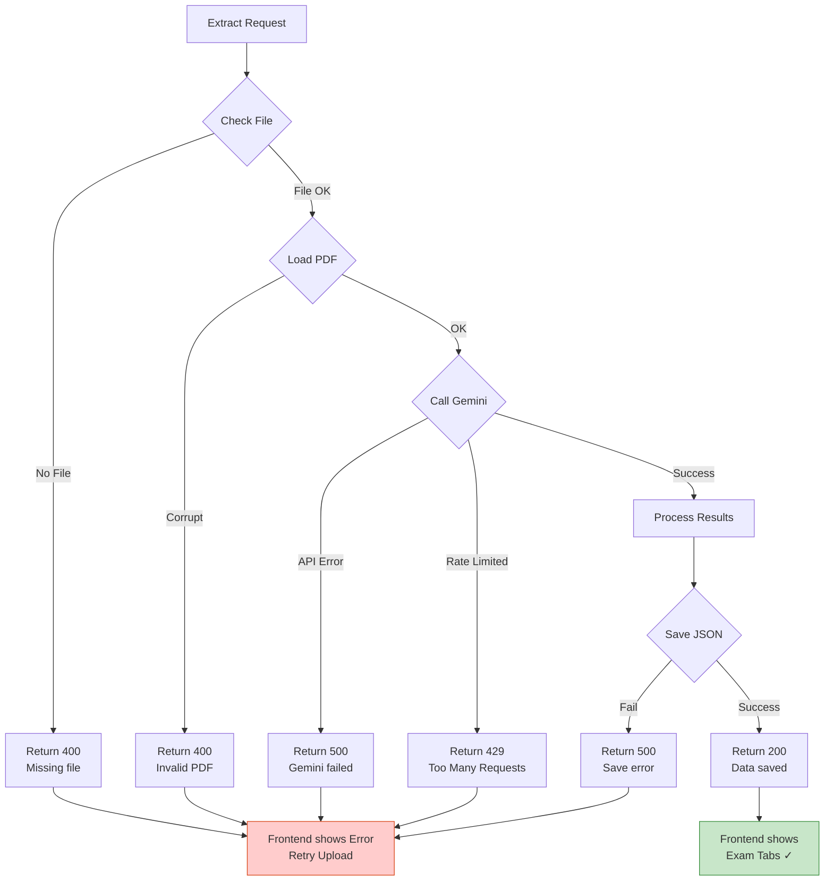

## Search & Filter Logic

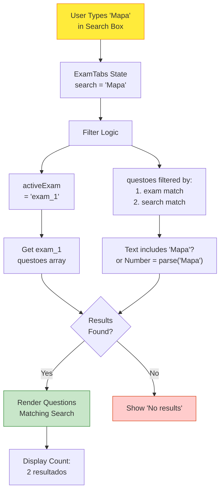

---

## Key Technologies in Diagram

| Component | Technology | Purpose |
|-----------|-----------|---------|
| **pdf_vision_engine_v2.py** | PyMuPDF + Gemini 2.5 Flash + PIL | Extraction & image processing |
| **ExamTabs.tsx** | React 19 + Tailwind | Tab interface for exams |
| **QuestionCard.tsx** | React + Markdown renderer | Display questions + images |
| **DataViewer.tsx** | React hooks | Smart view detection |
| **API Routes** | Next.js App Router | FastAPI-like endpoints |
| **Storage** | `/public/data/` + `/public/snippets/` | JSON + images |
| **Deployment** | Vercel + GitHub | CI/CD pipeline |

---

These diagrams show:
- ✅ Complete data flow from PDF to UI
- ✅ Component hierarchy and interactions
- ✅ JSON data structure
- ✅ Image association process
- ✅ API architecture
- ✅ Error handling
- ✅ Deployment pipeline

For visual rendering, paste any mermaid diagram into:
- **GitHub**: Directly in README (auto-renders)
- **Mermaid Live**: https://mermaid.live
- **Local**: Use Mermaid CLI
